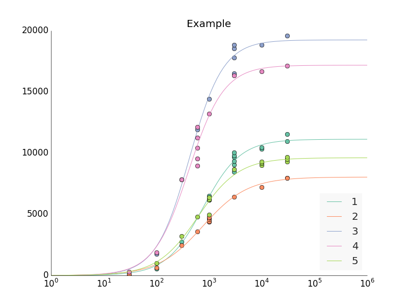
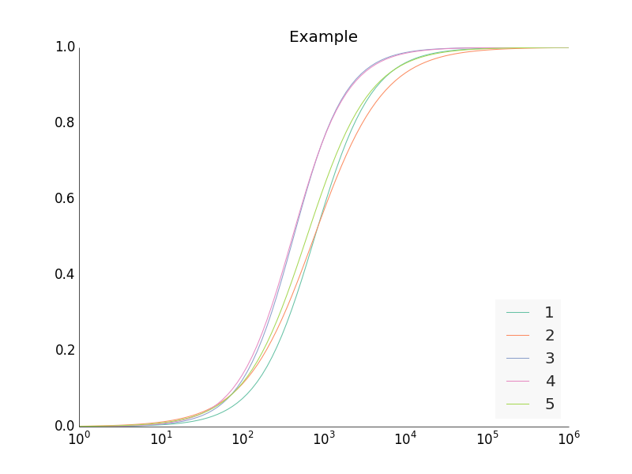
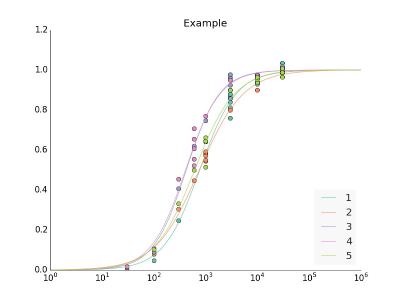
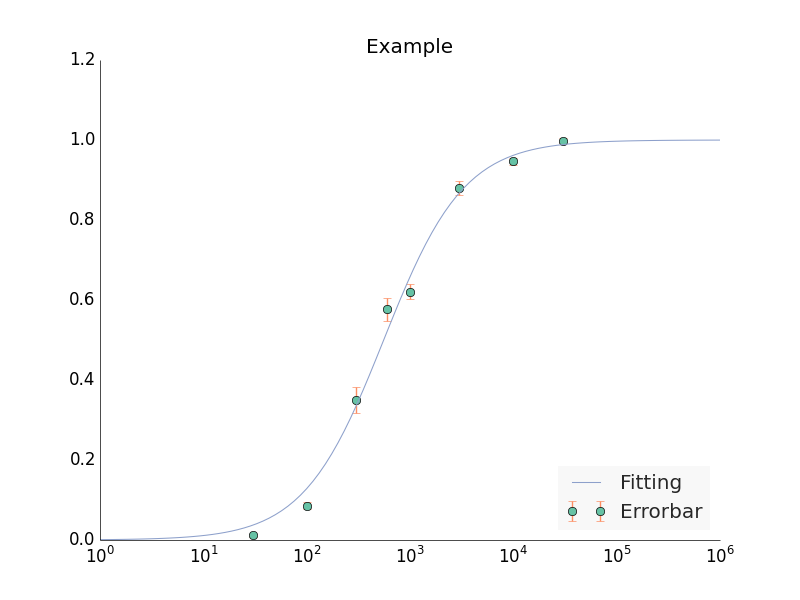

CVFIT
=====

A curve fitting program which fits the data with Hill
equation with weighted least square and obtaining the coefficients
including Y(0), Ymax, nH and Kr.

#Features
This program can fits different cells with different hill equation
and generates the fitting result.

All the coefficients can be normalised and produces several curves
with the same Ymax and Y(0).

All the original data can also be normalised and generate a curve
which takes into account all the data.

The standard deviation of the error in each concentration can be
plotted as error bar.

#Requirements
**numpy, scipy, matplotlib** Widely used library when dealling with
scientific calculation

**Markdown** A library which convert Markdown file to html

    pip install markdown

**Prettyplotlib** A matplotlib-enhancer library

    pip install prettyplotlib
