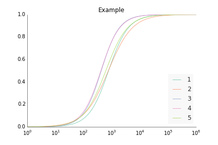
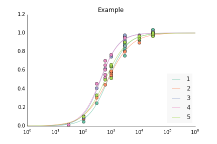

CVFIT
=====

CVFIT is a program for weighted least-squares fitting of various equations to experimental data, for calculating errors of fitting estimates and for plotting the results. Currently only the Hill equation fit is possible and the error calculation is being implemented. 

#Features
It is possible to fit several data sets simultaneously with the same equation. 

For dose-response curves: the data once fitted can be normalised to the fitted maxima.

All the original data can also be normalised and generate a curve
which takes into account all the data.

The standard deviation of the error in each concentration can be
plotted as error bar.

#Requirements
**numpy, scipy, matplotlib** Widely used library when dealling with
scientific calculation

**Markdown** A library which converts Markdown file to html

    pip install markdown

**Prettyplotlib** A matplotlib-enhancer library.

    pip install prettyplotlib
