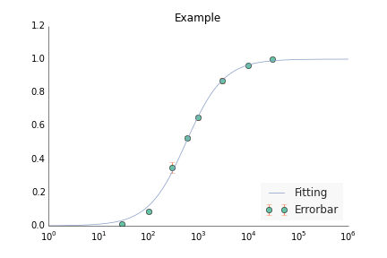

CVFIT
=====

CVFIT is a program for weighted least-squares fitting of various equations to experimental data, for calculating errors of fitting estimates and for plotting the results. Currently only the Hill equation fit is possible and the error calculation is being implemented. 

#Features
It is possible to fit several data sets simultaneously with the same equation. 

For dose-response curves: the data once fitted can be normalised to the fitted maxima.

A plot of averaged data points for each concentration with error bars indicating the standard deviation of the mean. 

#Requirements
**numpy, scipy, matplotlib** - Python libraries widely used in scientific calculations.

**Markdown** - A Python implmentation of Markdown.

    pip install markdown

**Prettyplotlib** - A matplotlib-enhancer library.

    pip install prettyplotlib
