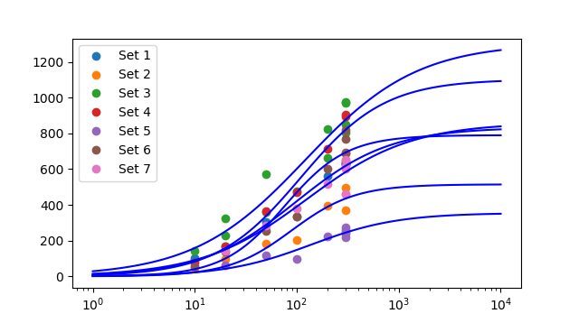

# CVFIT: Curve fitting program

Date and time of analysis: 2018/11/14 11:32:04
Machine: Pharm109; System: win32

# Original data:

Number of datasets loaded: 7

Set 1

 |  X  |  Y  |  s(Y)  |  weight | 
 |  ------  |  ------  |  ------  |  ------ | 
 |  10  |  90.5874  |  0  |  1 | | 
 |  10  |  103.059  |  0  |  1 | | 
 |  20  |  169.206  |  0  |  1 | | 
 |  50  |  304.107  |  0  |  1 | | 
 |  100  |  332.893  |  0  |  1 | | 
 |  200  |  563.583  |  0  |  1 | | 
 |  300  |  633.724  |  0  |  1 | | 
 |  300  |  628.074  |  0  |  1 | | 
 |  300  |  628.341  |  0  |  1 | | 
   | | 

Set 2

 |  X  |  Y  |  s(Y)  |  weight | 
 |  ------  |  ------  |  ------  |  ------ | 
 |  10  |  44.6445  |  0  |  1 | | 
 |  20  |  96.1439  |  0  |  1 | | 
 |  50  |  182.292  |  0  |  1 | | 
 |  100  |  203.971  |  0  |  1 | | 
 |  200  |  394.794  |  0  |  1 | | 
 |  300  |  369.152  |  0  |  1 | | 
 |  300  |  458.34  |  0  |  1 | | 
 |  300  |  497.025  |  0  |  1 | | 
   | | 

Set 3

 |  X  |  Y  |  s(Y)  |  weight | 
 |  ------  |  ------  |  ------  |  ------ | 
 |  10  |  144.962  |  0  |  1 | | 
 |  20  |  228.072  |  0  |  1 | | 
 |  20  |  325.843  |  0  |  1 | | 
 |  50  |  359.941  |  0  |  1 | | 
 |  50  |  571.488  |  0  |  1 | | 
 |  100  |  477.414  |  0  |  1 | | 
 |  200  |  661.291  |  0  |  1 | | 
 |  200  |  822.78  |  0  |  1 | | 
 |  300  |  804.874  |  0  |  1 | | 
 |  300  |  978  |  0  |  1 | | 
 |  300  |  971.521  |  0  |  1 | | 
 |  300  |  849.972  |  0  |  1 | | 
   | | 

Set 4

 |  X  |  Y  |  s(Y)  |  weight | 
 |  ------  |  ------  |  ------  |  ------ | 
 |  10  |  74.9393  |  0  |  1 | | 
 |  20  |  168.546  |  0  |  1 | | 
 |  50  |  365.788  |  0  |  1 | | 
 |  100  |  473.351  |  0  |  1 | | 
 |  200  |  714.229  |  0  |  1 | | 
 |  300  |  689.361  |  0  |  1 | | 
 |  300  |  893.892  |  0  |  1 | | 
 |  300  |  907.393  |  0  |  1 | | 
   | | 

Set 5

 |  X  |  Y  |  s(Y)  |  weight | 
 |  ------  |  ------  |  ------  |  ------ | 
 |  20  |  62.6688  |  0  |  1 | | 
 |  50  |  115  |  0  |  1 | | 
 |  100  |  95.4777  |  0  |  1 | | 
 |  200  |  223.862  |  0  |  1 | | 
 |  300  |  236.678  |  0  |  1 | | 
 |  300  |  220.554  |  0  |  1 | | 
 |  300  |  274.139  |  0  |  1 | | 
 |  300  |  259.1  |  0  |  1 | | 
 |  300  |  250.555  |  0  |  1 | | 
   | | 

Set 6

 |  X  |  Y  |  s(Y)  |  weight | 
 |  ------  |  ------  |  ------  |  ------ | 
 |  10  |  59.1356  |  0  |  1 | | 
 |  20  |  137.873  |  0  |  1 | | 
 |  50  |  252.149  |  0  |  1 | | 
 |  100  |  332.55  |  0  |  1 | | 
 |  200  |  600.011  |  0  |  1 | | 
 |  300  |  691.69  |  0  |  1 | | 
 |  300  |  637.672  |  0  |  1 | | 
 |  300  |  769.058  |  0  |  1 | | 
 |  300  |  820.244  |  0  |  1 | | 
 |  300  |  648.444  |  0  |  1 | | 
   | | 

Set 7

 |  X  |  Y  |  s(Y)  |  weight | 
 |  ------  |  ------  |  ------  |  ------ | 
 |  20  |  144.435  |  0  |  1 | | 
 |  50  |  284.816  |  0  |  1 | | 
 |  100  |  380.031  |  0  |  1 | | 
 |  200  |  517.36  |  0  |  1 | | 
 |  300  |  651.637  |  0  |  1 | | 
 |  300  |  601.588  |  0  |  1 | | 
 |  300  |  461.818  |  0  |  1 | | 
 |  300  |  617.457  |  0  |  1 | | 
   | | 

# Set 1 fit finished

Number of point fitted = 9
Number of parameters estimated = 3
Degrees of freedom = 6
Residual error SD = 38.907      (variance = 1513.769)
Parameter 1: Ymin  	= 0  	  (fixed)
Parameter 2: Ymax  	= 833.05  	  Approx SD = 110.299	  CV = 13.2
Parameter 3: EC50  	= 98.1276  	  Approx SD = 34.5079	  CV = 35.2
Parameter 4: nH    	= 0.942252  	  Approx SD = 0.141286	  CV = 15.0
Minimum SSD = 9082.617; 
Max log-likelihood = -43.896
Correlation matrix = [!!!! PRINTOUT OF CORRELATION MATRIX NOT IMPLEMENTED YET. SORRY.

WARNING: SOME PARAMETERS ARE STRONGLY CORRELATED (coeff > 0.9); try different guesses
WARNING: SOME PARAMETERS POORLY DEFINED (CV > 33%); try different guesses

LIKELIHOOD INTERVALS
2.99-unit Likelihood Intervals  (equivalent SD for Gaussian- 2.45)
Lmax= -43.8965;   Lcrit= -46.8904
Parameter 1:   Ymin	= 0	  (fixed)
Parameter 2:   Ymax	= 833.05	  LOWER = 681.23	  UPPER limit not found
Parameter 3:   EC50	= 98.1276	  LOWER = 57.0617	  UPPER limit not found
Parameter 4:   nH  	= 0.942252	  LOWER = 0.391249	  UPPER = 1.27312

# Set 2 fit finished

Number of point fitted = 8
Number of parameters estimated = 3
Degrees of freedom = 5
Residual error SD = 58.006      (variance = 3364.693)
Parameter 1: Ymin  	= 0  	  (fixed)
Parameter 2: Ymax  	= 514.596  	  Approx SD = 121.99	  CV = 23.7
Parameter 3: EC50  	= 89.4209  	  Approx SD = 43.0086	  CV = 48.1
Parameter 4: nH    	= 1.40081  	  Approx SD = 0.648406	  CV = 46.3
Minimum SSD = 16823.465; 
Max log-likelihood = -41.956
Correlation matrix = [!!!! PRINTOUT OF CORRELATION MATRIX NOT IMPLEMENTED YET. SORRY.

WARNING: SOME PARAMETERS ARE STRONGLY CORRELATED (coeff > 0.9); try different guesses
WARNING: SOME PARAMETERS POORLY DEFINED (CV > 33%); try different guesses

LIKELIHOOD INTERVALS
3.31-unit Likelihood Intervals  (equivalent SD for Gaussian- 2.57)
Lmax= -41.9559;   Lcrit= -45.2609
Parameter 1:   Ymin	= 0	  (fixed)
Parameter 2:   Ymax	= 514.596	  LOWER = 378.912	  UPPER limit not found
Parameter 3:   EC50	= 89.4209	  LOWER limit not found	  UPPER limit not found
Parameter 4:   nH  	= 1.40081	  LOWER = 0.314948	  UPPER = 3.27299

# Set 3 fit finished

Number of point fitted = 12
Number of parameters estimated = 3
Degrees of freedom = 9
Residual error SD = 98.537      (variance = 9709.615)
Parameter 1: Ymin  	= 0  	  (fixed)
Parameter 2: Ymax  	= 1304.88  	  Approx SD = 416.103	  CV = 31.9
Parameter 3: EC50  	= 121.947  	  Approx SD = 111.449	  CV = 91.4
Parameter 4: nH    	= 0.791286  	  Approx SD = 0.229847	  CV = 29.0
Minimum SSD = 87386.534; 
Max log-likelihood = -70.386
Correlation matrix = [!!!! PRINTOUT OF CORRELATION MATRIX NOT IMPLEMENTED YET. SORRY.

WARNING: SOME PARAMETERS ARE STRONGLY CORRELATED (coeff > 0.9); try different guesses
WARNING: SOME PARAMETERS POORLY DEFINED (CV > 33%); try different guesses

LIKELIHOOD INTERVALS
2.56-unit Likelihood Intervals  (equivalent SD for Gaussian- 2.26)
Lmax= -70.3864;   Lcrit= -72.9447
Parameter 1:   Ymin	= 0	  (fixed)
Parameter 2:   Ymax	= 1304.88	  LOWER = 875.628	  UPPER limit not found
Parameter 3:   EC50	= 121.947	  LOWER limit not found	  UPPER limit not found
Parameter 4:   nH  	= 0.791286	  LOWER = 0.307929	  UPPER = 1.41833

# Set 4 fit finished

Number of point fitted = 8
Number of parameters estimated = 3
Degrees of freedom = 5
Residual error SD = 82.477      (variance = 6802.457)
Parameter 1: Ymin  	= 0  	  (fixed)
Parameter 2: Ymax  	= 1102.02  	  Approx SD = 290.493	  CV = 26.4
Parameter 3: EC50  	= 108.998  	  Approx SD = 68.5551	  CV = 62.9
Parameter 4: nH    	= 1.05004  	  Approx SD = 0.322533	  CV = 30.7
Minimum SSD = 34012.286; 
Max log-likelihood = -44.772
Correlation matrix = [!!!! PRINTOUT OF CORRELATION MATRIX NOT IMPLEMENTED YET. SORRY.

WARNING: SOME PARAMETERS ARE STRONGLY CORRELATED (coeff > 0.9); try different guesses
WARNING: SOME PARAMETERS POORLY DEFINED (CV > 33%); try different guesses

LIKELIHOOD INTERVALS
3.31-unit Likelihood Intervals  (equivalent SD for Gaussian- 2.57)
Lmax= -44.7717;   Lcrit= -48.0767
Parameter 1:   Ymin	= 0	  (fixed)
Parameter 2:   Ymax	= 1102.02	  LOWER = 757.77	  UPPER limit not found
Parameter 3:   EC50	= 108.998	  LOWER limit not found	  UPPER limit not found
Parameter 4:   nH  	= 1.05004	  LOWER = 0.371431	  UPPER = 2.37811

# Set 5 fit finished

Number of point fitted = 9
Number of parameters estimated = 3
Degrees of freedom = 6
Residual error SD = 30.623      (variance = 937.782)
Parameter 1: Ymin  	= 0  	  (fixed)
Parameter 2: Ymax  	= 354.499  	  Approx SD = 118.229	  CV = 33.4
Parameter 3: EC50  	= 138.429  	  Approx SD = 106.168	  CV = 76.7
Parameter 4: nH    	= 1.0299  	  Approx SD = 0.385125	  CV = 37.4
Minimum SSD = 5626.690; 
Max log-likelihood = -41.742
Correlation matrix = [!!!! PRINTOUT OF CORRELATION MATRIX NOT IMPLEMENTED YET. SORRY.

WARNING: SOME PARAMETERS ARE STRONGLY CORRELATED (coeff > 0.9); try different guesses
WARNING: SOME PARAMETERS POORLY DEFINED (CV > 33%); try different guesses

LIKELIHOOD INTERVALS
2.99-unit Likelihood Intervals  (equivalent SD for Gaussian- 2.45)
Lmax= -41.7417;   Lcrit= -44.7356
Parameter 1:   Ymin	= 0	  (fixed)
Parameter 2:   Ymax	= 354.499	  LOWER = 240.077	  UPPER limit not found
Parameter 3:   EC50	= 138.429	  LOWER limit not found	  UPPER limit not found
Parameter 4:   nH  	= 1.0299	  LOWER = 0.295489	  UPPER = 2.27232

# Set 6 fit finished

Number of point fitted = 10
Number of parameters estimated = 3
Degrees of freedom = 7
Residual error SD = 83.957      (variance = 7048.808)
Parameter 1: Ymin  	= 0  	  (fixed)
Parameter 2: Ymax  	= 790.02  	  Approx SD = 91.0781	  CV = 11.5
Parameter 3: EC50  	= 76.5751  	  Approx SD = 21.2809	  CV = 27.8
Parameter 4: nH    	= 1.43716  	  Approx SD = 0.417516	  CV = 29.1
Minimum SSD = 49341.654; 
Max log-likelihood = -56.709
Correlation matrix = [!!!! PRINTOUT OF CORRELATION MATRIX NOT IMPLEMENTED YET. SORRY.

LIKELIHOOD INTERVALS
2.8-unit Likelihood Intervals  (equivalent SD for Gaussian- 2.37)
Lmax= -56.7091;   Lcrit= -59.5057
Parameter 1:   Ymin	= 0	  (fixed)
Parameter 2:   Ymax	= 790.02	  LOWER = 657.078	  UPPER limit not found
Parameter 3:   EC50	= 76.5751	  LOWER = 49.4444	  UPPER limit not found
Parameter 4:   nH  	= 1.43716	  LOWER = 0.369703	  UPPER = 3.38501

# Set 7 fit finished

Number of point fitted = 8
Number of parameters estimated = 3
Degrees of freedom = 5
Residual error SD = 65.191      (variance = 4249.920)
Parameter 1: Ymin  	= 0  	  (fixed)
Parameter 2: Ymax  	= 859.761  	  Approx SD = 584.792	  CV = 68.0
Parameter 3: EC50  	= 124.423  	  Approx SD = 228.302	  CV = 183.5
Parameter 4: nH    	= 0.846671  	  Approx SD = 0.584288	  CV = 69.0
Minimum SSD = 21249.601; 
Max log-likelihood = -42.890
Correlation matrix = [!!!! PRINTOUT OF CORRELATION MATRIX NOT IMPLEMENTED YET. SORRY.

WARNING: SOME PARAMETERS ARE STRONGLY CORRELATED (coeff > 0.9); try different guesses
WARNING: SOME PARAMETERS POORLY DEFINED (CV > 33%); try different guesses

LIKELIHOOD INTERVALS
3.31-unit Likelihood Intervals  (equivalent SD for Gaussian- 2.57)
Lmax= -42.8901;   Lcrit= -46.1951
Parameter 1:   Ymin	= 0	  (fixed)
Parameter 2:   Ymax	= 859.761	  LOWER = 521.327	  UPPER limit not found
Parameter 3:   EC50	= 124.423	  LOWER limit not found	  UPPER limit not found
Parameter 4:   nH  	= 0.846671	  LOWER = 0.257673	  UPPER = 2.87113

# Average of all fits:

Average of estimates of 7 sets (mean +/- sdm):
Parameter 1: Ymin  	= 0 +/- 0
	(all: 0.0	0.0	0.0	0.0	0.0	0.0	0.0
Parameter 2: Ymax  	= 822.69 +/- 113.138
	(all: 833.0502047660507	514.5963131381096	1304.8790402312839	1102.0247511704779	354.4990825823609	790.0202436896237	859.7614689563436
Parameter 3: EC50  	= 108.274 +/- 7.58726
	(all: 98.12762146610356	89.42094396478649	121.94716418762894	108.99772770980599	138.4285019724258	76.57508613300271	124.42265832588805
Parameter 4: nH    	= 1.07116 +/- 0.0892277
	(all: 0.9422523297420383	1.4008111397321068	0.7912863322175352	1.05004010997712	1.0298996541554568	1.4371623720979385	0.8466714581704021

