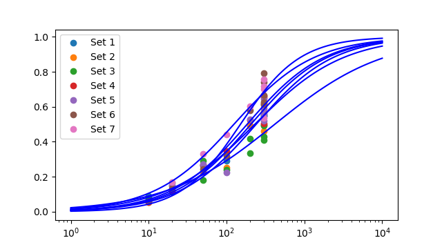
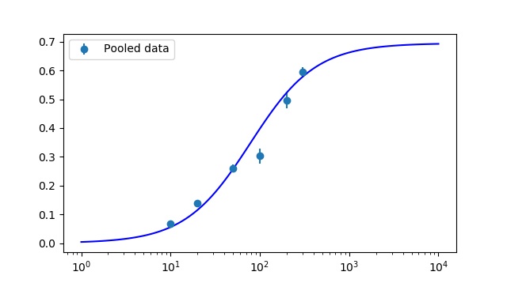
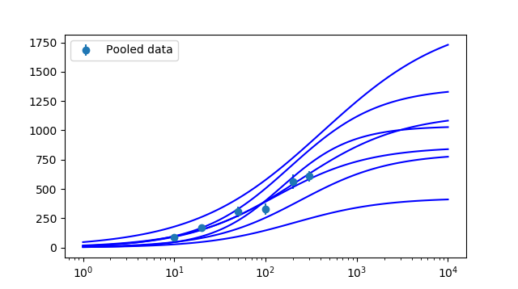

# CVFIT: Curve fitting program

Date and time of analysis: 2018/11/14 11:32:32
Machine: Pharm109; System: win32

# Original data:

Number of datasets loaded: 7

Set 1

 |  X  |  Y  |  s(Y)  |  weight | 
 |  ------  |  ------  |  ------  |  ------ | 
 |  10  |  90.5874  |  0  |  1 | | 
 |  10  |  103.059  |  0  |  1 | | 
 |  20  |  169.206  |  0  |  1 | | 
 |  50  |  304.107  |  0  |  1 | | 
 |  100  |  332.893  |  0  |  1 | | 
 |  200  |  563.583  |  0  |  1 | | 
 |  300  |  633.724  |  0  |  1 | | 
 |  300  |  628.074  |  0  |  1 | | 
 |  300  |  628.341  |  0  |  1 | | 
   | | 

Set 2

 |  X  |  Y  |  s(Y)  |  weight | 
 |  ------  |  ------  |  ------  |  ------ | 
 |  10  |  44.6445  |  0  |  1 | | 
 |  20  |  96.1439  |  0  |  1 | | 
 |  50  |  182.292  |  0  |  1 | | 
 |  100  |  203.971  |  0  |  1 | | 
 |  200  |  394.794  |  0  |  1 | | 
 |  300  |  369.152  |  0  |  1 | | 
 |  300  |  458.34  |  0  |  1 | | 
 |  300  |  497.025  |  0  |  1 | | 
   | | 

Set 3

 |  X  |  Y  |  s(Y)  |  weight | 
 |  ------  |  ------  |  ------  |  ------ | 
 |  10  |  144.962  |  0  |  1 | | 
 |  20  |  228.072  |  0  |  1 | | 
 |  20  |  325.843  |  0  |  1 | | 
 |  50  |  359.941  |  0  |  1 | | 
 |  50  |  571.488  |  0  |  1 | | 
 |  100  |  477.414  |  0  |  1 | | 
 |  200  |  661.291  |  0  |  1 | | 
 |  200  |  822.78  |  0  |  1 | | 
 |  300  |  804.874  |  0  |  1 | | 
 |  300  |  978  |  0  |  1 | | 
 |  300  |  971.521  |  0  |  1 | | 
 |  300  |  849.972  |  0  |  1 | | 
   | | 

Set 4

 |  X  |  Y  |  s(Y)  |  weight | 
 |  ------  |  ------  |  ------  |  ------ | 
 |  10  |  74.9393  |  0  |  1 | | 
 |  20  |  168.546  |  0  |  1 | | 
 |  50  |  365.788  |  0  |  1 | | 
 |  100  |  473.351  |  0  |  1 | | 
 |  200  |  714.229  |  0  |  1 | | 
 |  300  |  689.361  |  0  |  1 | | 
 |  300  |  893.892  |  0  |  1 | | 
 |  300  |  907.393  |  0  |  1 | | 
   | | 

Set 5

 |  X  |  Y  |  s(Y)  |  weight | 
 |  ------  |  ------  |  ------  |  ------ | 
 |  20  |  62.6688  |  0  |  1 | | 
 |  50  |  115  |  0  |  1 | | 
 |  100  |  95.4777  |  0  |  1 | | 
 |  200  |  223.862  |  0  |  1 | | 
 |  300  |  236.678  |  0  |  1 | | 
 |  300  |  220.554  |  0  |  1 | | 
 |  300  |  274.139  |  0  |  1 | | 
 |  300  |  259.1  |  0  |  1 | | 
 |  300  |  250.555  |  0  |  1 | | 
   | | 

Set 6

 |  X  |  Y  |  s(Y)  |  weight | 
 |  ------  |  ------  |  ------  |  ------ | 
 |  10  |  59.1356  |  0  |  1 | | 
 |  20  |  137.873  |  0  |  1 | | 
 |  50  |  252.149  |  0  |  1 | | 
 |  100  |  332.55  |  0  |  1 | | 
 |  200  |  600.011  |  0  |  1 | | 
 |  300  |  691.69  |  0  |  1 | | 
 |  300  |  637.672  |  0  |  1 | | 
 |  300  |  769.058  |  0  |  1 | | 
 |  300  |  820.244  |  0  |  1 | | 
 |  300  |  648.444  |  0  |  1 | | 
   | | 

Set 7

 |  X  |  Y  |  s(Y)  |  weight | 
 |  ------  |  ------  |  ------  |  ------ | 
 |  20  |  144.435  |  0  |  1 | | 
 |  50  |  284.816  |  0  |  1 | | 
 |  100  |  380.031  |  0  |  1 | | 
 |  200  |  517.36  |  0  |  1 | | 
 |  300  |  651.637  |  0  |  1 | | 
 |  300  |  601.588  |  0  |  1 | | 
 |  300  |  461.818  |  0  |  1 | | 
 |  300  |  617.457  |  0  |  1 | | 
   | | 

# Set 1 fit finished

Number of point fitted = 9
Number of parameters estimated = 3
Degrees of freedom = 6
Residual error SD = 31.252      (variance = 976.707)
Parameter 1: Ymin  	= 0  	  (fixed)
Parameter 2: Ymax  	= 1143.73  	  Approx SD = 584.817	  CV = 51.1
Parameter 3: EC50  	= 230.986  	  Approx SD = 317.147	  CV = 137.3
Parameter 4: nH    	= 0.764431  	  Approx SD = 0.220263	  CV = 28.8
Minimum SSD = 5860.239; 
Max log-likelihood = -41.925
Correlation matrix = [!!!! PRINTOUT OF CORRELATION MATRIX NOT IMPLEMENTED YET. SORRY.

WARNING: SOME PARAMETERS ARE STRONGLY CORRELATED (coeff > 0.9); try different guesses
WARNING: SOME PARAMETERS POORLY DEFINED (CV > 33%); try different guesses

LIKELIHOOD INTERVALS
2.99-unit Likelihood Intervals  (equivalent SD for Gaussian- 2.45)
Lmax= -41.9247;   Lcrit= -44.9186
Parameter 1:   Ymin	= 0	  (fixed)
Parameter 2:   Ymax	= 1143.73	  LOWER = 766.404	  UPPER limit not found
Parameter 3:   EC50	= 230.986	  LOWER limit not found	  UPPER limit not found
Parameter 4:   nH  	= 0.764431	  LOWER = 0.424606	  UPPER = 1.06708

# Set 2 fit finished

Number of point fitted = 8
Number of parameters estimated = 3
Degrees of freedom = 5
Residual error SD = 49.844      (variance = 2484.430)
Parameter 1: Ymin  	= 0  	  (fixed)
Parameter 2: Ymax  	= 803.956  	  Approx SD = 516.665	  CV = 64.3
Parameter 3: EC50  	= 240.065  	  Approx SD = 358.891	  CV = 149.5
Parameter 4: nH    	= 0.880558  	  Approx SD = 0.347303	  CV = 39.4
Minimum SSD = 12422.148; 
Max log-likelihood = -40.743
Correlation matrix = [!!!! PRINTOUT OF CORRELATION MATRIX NOT IMPLEMENTED YET. SORRY.

WARNING: SOME PARAMETERS ARE STRONGLY CORRELATED (coeff > 0.9); try different guesses
WARNING: SOME PARAMETERS POORLY DEFINED (CV > 33%); try different guesses

LIKELIHOOD INTERVALS
3.31-unit Likelihood Intervals  (equivalent SD for Gaussian- 2.57)
Lmax= -40.7427;   Lcrit= -44.0477
Parameter 1:   Ymin	= 0	  (fixed)
Parameter 2:   Ymax	= 803.956	  LOWER = 411.549	  UPPER limit not found
Parameter 3:   EC50	= 240.065	  LOWER limit not found	  UPPER limit not found
Parameter 4:   nH  	= 0.880558	  LOWER = 0.362597	  UPPER = 2.37166

# Set 3 fit finished

Number of point fitted = 12
Number of parameters estimated = 3
Degrees of freedom = 9
Residual error SD = 94.848      (variance = 8996.074)
Parameter 1: Ymin  	= 0  	  (fixed)
Parameter 2: Ymax  	= 1971.99  	  Approx SD = 1728.37	  CV = 87.6
Parameter 3: EC50  	= 416.522  	  Approx SD = 1099	  CV = 263.9
Parameter 4: nH    	= 0.619405  	  Approx SD = 0.236446	  CV = 38.2
Minimum SSD = 80964.670; 
Max log-likelihood = -69.928
Correlation matrix = [!!!! PRINTOUT OF CORRELATION MATRIX NOT IMPLEMENTED YET. SORRY.

WARNING: SOME PARAMETERS ARE STRONGLY CORRELATED (coeff > 0.9); try different guesses
WARNING: SOME PARAMETERS POORLY DEFINED (CV > 33%); try different guesses

LIKELIHOOD INTERVALS
2.56-unit Likelihood Intervals  (equivalent SD for Gaussian- 2.26)
Lmax= -69.9284;   Lcrit= -72.4868
Parameter 1:   Ymin	= 0	  (fixed)
Parameter 2:   Ymax	= 1971.99	  LOWER = 905.829	  UPPER limit not found
Parameter 3:   EC50	= 416.522	  LOWER limit not found	  UPPER limit not found
Parameter 4:   nH  	= 0.619405	  LOWER = 0.31908	  UPPER = 1.31146

# Set 4 fit finished

Number of point fitted = 8
Number of parameters estimated = 3
Degrees of freedom = 5
Residual error SD = 80.850      (variance = 6536.686)
Parameter 1: Ymin  	= 0  	  (fixed)
Parameter 2: Ymax  	= 1367.54  	  Approx SD = 889.198	  CV = 65.0
Parameter 3: EC50  	= 183.863  	  Approx SD = 292.738	  CV = 159.2
Parameter 4: nH    	= 0.884377  	  Approx SD = 0.404032	  CV = 45.7
Minimum SSD = 32683.428; 
Max log-likelihood = -44.612
Correlation matrix = [!!!! PRINTOUT OF CORRELATION MATRIX NOT IMPLEMENTED YET. SORRY.

WARNING: SOME PARAMETERS ARE STRONGLY CORRELATED (coeff > 0.9); try different guesses
WARNING: SOME PARAMETERS POORLY DEFINED (CV > 33%); try different guesses

LIKELIHOOD INTERVALS
3.31-unit Likelihood Intervals  (equivalent SD for Gaussian- 2.57)
Lmax= -44.6122;   Lcrit= -47.9173
Parameter 1:   Ymin	= 0	  (fixed)
Parameter 2:   Ymax	= 1367.54	  LOWER = 764.749	  UPPER limit not found
Parameter 3:   EC50	= 183.863	  LOWER limit not found	  UPPER limit not found
Parameter 4:   nH  	= 0.884377	  LOWER = 0.377167	  UPPER = 2.29442

# Set 5 fit finished

Number of point fitted = 9
Number of parameters estimated = 3
Degrees of freedom = 6
Residual error SD = 29.345      (variance = 861.136)
Parameter 1: Ymin  	= 0  	  (fixed)
Parameter 2: Ymax  	= 423.188  	  Approx SD = 177.477	  CV = 41.9
Parameter 3: EC50  	= 205.898  	  Approx SD = 205.79	  CV = 99.9
Parameter 4: nH    	= 0.889918  	  Approx SD = 0.294992	  CV = 33.1
Minimum SSD = 5166.816; 
Max log-likelihood = -41.358
Correlation matrix = [!!!! PRINTOUT OF CORRELATION MATRIX NOT IMPLEMENTED YET. SORRY.

WARNING: SOME PARAMETERS ARE STRONGLY CORRELATED (coeff > 0.9); try different guesses
WARNING: SOME PARAMETERS POORLY DEFINED (CV > 33%); try different guesses

LIKELIHOOD INTERVALS
2.99-unit Likelihood Intervals  (equivalent SD for Gaussian- 2.45)
Lmax= -41.358;   Lcrit= -44.3519
Parameter 1:   Ymin	= 0	  (fixed)
Parameter 2:   Ymax	= 423.188	  LOWER = 246.335	  UPPER limit not found
Parameter 3:   EC50	= 205.898	  LOWER limit not found	  UPPER limit not found
Parameter 4:   nH  	= 0.889918	  LOWER = 0.310468	  UPPER = 2.08124

# Set 6 fit finished

Number of point fitted = 10
Number of parameters estimated = 3
Degrees of freedom = 7
Residual error SD = 67.558      (variance = 4564.050)
Parameter 1: Ymin  	= 0  	  (fixed)
Parameter 2: Ymax  	= 1036.55  	  Approx SD = 292.719	  CV = 28.2
Parameter 3: EC50  	= 150.933  	  Approx SD = 89.0187	  CV = 59.0
Parameter 4: nH    	= 1.13486  	  Approx SD = 0.327548	  CV = 28.9
Minimum SSD = 31948.353; 
Max log-likelihood = -54.536
Correlation matrix = [!!!! PRINTOUT OF CORRELATION MATRIX NOT IMPLEMENTED YET. SORRY.

WARNING: SOME PARAMETERS ARE STRONGLY CORRELATED (coeff > 0.9); try different guesses
WARNING: SOME PARAMETERS POORLY DEFINED (CV > 33%); try different guesses

LIKELIHOOD INTERVALS
2.8-unit Likelihood Intervals  (equivalent SD for Gaussian- 2.37)
Lmax= -54.5358;   Lcrit= -57.3325
Parameter 1:   Ymin	= 0	  (fixed)
Parameter 2:   Ymax	= 1036.55	  LOWER = 729.618	  UPPER limit not found
Parameter 3:   EC50	= 150.933	  LOWER limit not found	  UPPER limit not found
Parameter 4:   nH  	= 1.13486	  LOWER = 0.438503	  UPPER = 2.1183

# Set 7 fit finished

Number of point fitted = 8
Number of parameters estimated = 3
Degrees of freedom = 5
Residual error SD = 65.191      (variance = 4249.920)
Parameter 1: Ymin  	= 0  	  (fixed)
Parameter 2: Ymax  	= 859.761  	  Approx SD = 584.792	  CV = 68.0
Parameter 3: EC50  	= 124.423  	  Approx SD = 228.302	  CV = 183.5
Parameter 4: nH    	= 0.846671  	  Approx SD = 0.584288	  CV = 69.0
Minimum SSD = 21249.601; 
Max log-likelihood = -42.890
Correlation matrix = [!!!! PRINTOUT OF CORRELATION MATRIX NOT IMPLEMENTED YET. SORRY.

WARNING: SOME PARAMETERS ARE STRONGLY CORRELATED (coeff > 0.9); try different guesses
WARNING: SOME PARAMETERS POORLY DEFINED (CV > 33%); try different guesses

LIKELIHOOD INTERVALS
3.31-unit Likelihood Intervals  (equivalent SD for Gaussian- 2.57)
Lmax= -42.8901;   Lcrit= -46.1951
Parameter 1:   Ymin	= 0	  (fixed)
Parameter 2:   Ymax	= 859.761	  LOWER = 521.327	  UPPER limit not found
Parameter 3:   EC50	= 124.423	  LOWER limit not found	  UPPER limit not found
Parameter 4:   nH  	= 0.846671	  LOWER = 0.257673	  UPPER = 2.87113

# Average of all fits:

Average of estimates of 7 sets (mean +/- sdm):
Parameter 1: Ymin  	= 0 +/- 0
	(all: 0.0	0.0	0.0	0.0	0.0	0.0	0.0
Parameter 2: Ymax  	= 1086.67 +/- 171.433
	(all: 1143.7312960854829	803.9556146409365	1971.990707463664	1367.5368977658468	423.1879032823614	1036.5476759456135	859.7614689563436
Parameter 3: EC50  	= 221.813 +/- 33.3599
	(all: 230.9860250620367	240.06523899619526	416.52207419140785	183.86301431432383	205.89795028029556	150.9332014218139	124.42265832588805
Parameter 4: nH    	= 0.860031 +/- 0.0543337
	(all: 0.764431360429947	0.8805580967402109	0.6194049877611011	0.8843771595705932	0.8899177347476501	1.1348573485048412	0.8466714581704021

# Data normalised to the fitted maxima

# Pooled data fit finished

Number of point fitted = 64
Number of parameters estimated = 3
Degrees of freedom = 61
Residual error SD = 0.085      (variance = 0.007)
Parameter 1: Ymin  	= 0  	  (fixed)
Parameter 2: Ymax  	= 0.694842  	  Approx SD = 0.0532625	  CV = 7.7
Parameter 3: EC50  	= 78.2797  	  Approx SD = 14.5055	  CV = 18.5
Parameter 4: nH    	= 1.18737  	  Approx SD = 0.163175	  CV = 13.7
Minimum SSD = 0.441; 
Max log-likelihood = 68.441
Correlation matrix = [!!!! PRINTOUT OF CORRELATION MATRIX NOT IMPLEMENTED YET. SORRY.

LIKELIHOOD INTERVALS
2-unit Likelihood Intervals  (equivalent SD for Gaussian- 2)
Lmax= 68.4413;   Lcrit= 66.442
Parameter 1:   Ymin	= 0	  (fixed)
Parameter 2:   Ymax	= 0.694842	  LOWER = 0.638884	  UPPER limit not found
Parameter 3:   EC50	= 78.2797	  LOWER = 65.3628	  UPPER limit not found
Parameter 4:   nH  	= 1.18737	  LOWER limit not found	  UPPER = 1.45344

# Pooled data

