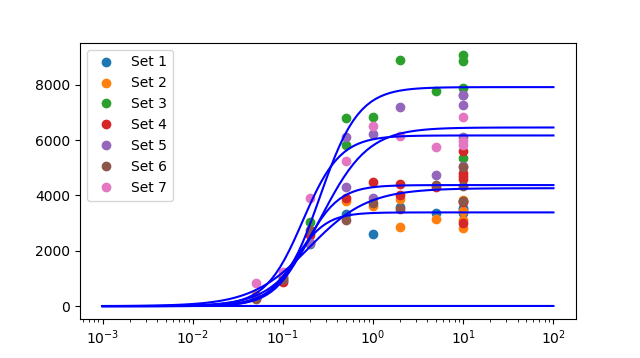
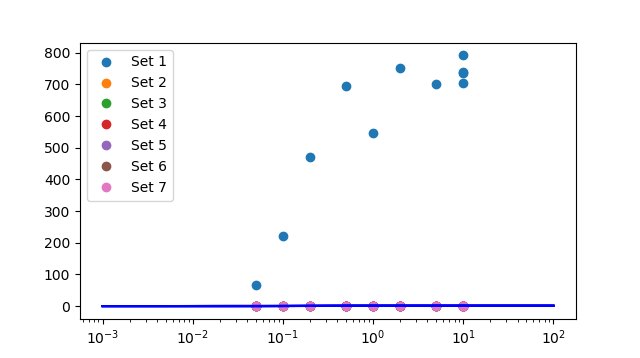
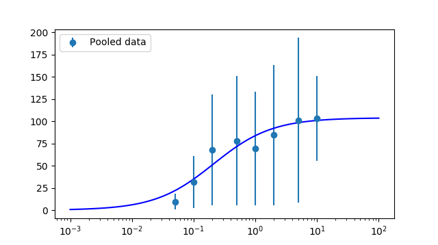

# CVFIT: Curve fitting program

Date and time of analysis: 2018/11/14 11:37:14
Machine: Pharm109; System: win32

# Original data:

Number of datasets loaded: 7

Set 1

 |  X  |  Y  |  s(Y)  |  weight | 
 |  ------  |  ------  |  ------  |  ------ | 
 |  0.05  |  319.964  |  0  |  1 | | 
 |  0.1  |  1052.76  |  0  |  1 | | 
 |  0.2  |  2254.67  |  0  |  1 | | 
 |  0.5  |  3319.22  |  0  |  1 | | 
 |  1  |  2616.93  |  0  |  1 | | 
 |  2  |  3593.12  |  0  |  1 | | 
 |  5  |  3352.19  |  0  |  1 | | 
 |  10  |  3782.98  |  0  |  1 | | 
 |  10  |  3515.37  |  0  |  1 | | 
 |  10  |  3536.82  |  0  |  1 | | 
 |  10  |  3366.5  |  0  |  1 | | 
   | | 

Set 2

 |  X  |  Y  |  s(Y)  |  weight | 
 |  ------  |  ------  |  ------  |  ------ | 
 |  0.05  |  397.973  |  0  |  1 | | 
 |  0.1  |  1103.26  |  0  |  1 | | 
 |  0.2  |  2264.53  |  0  |  1 | | 
 |  0.5  |  3784.67  |  0  |  1 | | 
 |  1  |  3599.15  |  0  |  1 | | 
 |  2  |  3859.39  |  0  |  1 | | 
 |  2  |  2848.39  |  0  |  1 | | 
 |  5  |  3162.45  |  0  |  1 | | 
 |  10  |  3832.87  |  0  |  1 | | 
 |  10  |  3423.72  |  0  |  1 | | 
 |  10  |  3100.23  |  0  |  1 | | 
 |  10  |  2826.72  |  0  |  1 | | 
   | | 

Set 3

 |  X  |  Y  |  s(Y)  |  weight | 
 |  ------  |  ------  |  ------  |  ------ | 
 |  0.05  |  306.079  |  0  |  1 | | 
 |  0.1  |  919.307  |  0  |  1 | | 
 |  0.2  |  3028.15  |  0  |  1 | | 
 |  0.5  |  5813.87  |  0  |  1 | | 
 |  0.5  |  6791.47  |  0  |  1 | | 
 |  1  |  6837.33  |  0  |  1 | | 
 |  2  |  8897.22  |  0  |  1 | | 
 |  5  |  7781.85  |  0  |  1 | | 
 |  10  |  5340.77  |  0  |  1 | | 
 |  10  |  7864.58  |  0  |  1 | | 
 |  10  |  8860.95  |  0  |  1 | | 
 |  10  |  9055.28  |  0  |  1 | | 
   | | 

Set 4

 |  X  |  Y  |  s(Y)  |  weight | 
 |  ------  |  ------  |  ------  |  ------ | 
 |  0.05  |  282.312  |  0  |  1 | | 
 |  0.1  |  855.595  |  0  |  1 | | 
 |  0.2  |  2562.56  |  0  |  1 | | 
 |  0.5  |  3911.4  |  0  |  1 | | 
 |  1  |  4492.65  |  0  |  1 | | 
 |  2  |  4426.95  |  0  |  1 | | 
 |  2  |  3999  |  0  |  1 | | 
 |  5  |  4307.51  |  0  |  1 | | 
 |  10  |  5588.11  |  0  |  1 | | 
 |  10  |  3752.53  |  0  |  1 | | 
 |  10  |  3003.99  |  0  |  1 | | 
 |  10  |  4824.4  |  0  |  1 | | 
 |  10  |  4606.37  |  0  |  1 | | 
 |  10  |  4689.06  |  0  |  1 | | 
   | | 

Set 5

 |  X  |  Y  |  s(Y)  |  weight | 
 |  ------  |  ------  |  ------  |  ------ | 
 |  0.05  |  296.948  |  0  |  1 | | 
 |  0.1  |  977.019  |  0  |  1 | | 
 |  0.2  |  2275.37  |  0  |  1 | | 
 |  0.5  |  4314.2  |  0  |  1 | | 
 |  0.5  |  6128.02  |  0  |  1 | | 
 |  1  |  3899.71  |  0  |  1 | | 
 |  1  |  6217.41  |  0  |  1 | | 
 |  2  |  7183.85  |  0  |  1 | | 
 |  5  |  4733.49  |  0  |  1 | | 
 |  10  |  6116.6  |  0  |  1 | | 
 |  10  |  5075.93  |  0  |  1 | | 
 |  10  |  7630.73  |  0  |  1 | | 
 |  10  |  7622.14  |  0  |  1 | | 
 |  10  |  7260.46  |  0  |  1 | | 
   | | 

Set 6

 |  X  |  Y  |  s(Y)  |  weight | 
 |  ------  |  ------  |  ------  |  ------ | 
 |  0.05  |  257.781  |  0  |  1 | | 
 |  0.1  |  980.898  |  0  |  1 | | 
 |  0.2  |  2751.72  |  0  |  1 | | 
 |  0.5  |  3103.99  |  0  |  1 | | 
 |  1  |  3712.55  |  0  |  1 | | 
 |  2  |  3516.46  |  0  |  1 | | 
 |  5  |  4374.71  |  0  |  1 | | 
 |  10  |  3803.67  |  0  |  1 | | 
 |  10  |  4328.67  |  0  |  1 | | 
 |  10  |  5021.01  |  0  |  1 | | 
   | | 

Set 7

 |  X  |  Y  |  s(Y)  |  weight | 
 |  ------  |  ------  |  ------  |  ------ | 
 |  0.05  |  825.581  |  0  |  1 | | 
 |  0.1  |  1235.18  |  0  |  1 | | 
 |  0.2  |  3923.25  |  0  |  1 | | 
 |  0.5  |  5244.38  |  0  |  1 | | 
 |  1  |  6523.26  |  0  |  1 | | 
 |  2  |  6159.81  |  0  |  1 | | 
 |  5  |  5764.82  |  0  |  1 | | 
 |  10  |  6834.3  |  0  |  1 | | 
 |  10  |  5819.93  |  0  |  1 | | 
 |  10  |  5970.89  |  0  |  1 | | 
   | | 

# Set 1 fit finished

Number of point fitted = 11
Number of parameters estimated = 3
Degrees of freedom = 8
Residual error SD = 3509.367      (variance = 12315653.311)
Parameter 1: Ymin  	= 0  	  (fixed)
Parameter 2: Ymax  	= 4.78213  	  Approx SD = nan	  CV = nan
Parameter 3: EC50  	= 0.0113499  	  Approx SD = nan	  CV = nan
Parameter 4: nH    	= 3.2002  	  Approx SD = nan	  CV = nan
Minimum SSD = 98525226.490; 
Max log-likelihood = -103.652
Correlation matrix = [!!!! PRINTOUT OF CORRELATION MATRIX NOT IMPLEMENTED YET. SORRY.

LIKELIHOOD INTERVALS
2.66-unit Likelihood Intervals  (equivalent SD for Gaussian- 2.31)
Lmax= -103.652;   Lcrit= -106.311
Parameter 1:   Ymin	= 0	  (fixed)
Parameter 2:   Ymax	= 4.78213	  LOWER = nan	  UPPER = nan
Parameter 3:   EC50	= 0.0113499	  LOWER = nan	  UPPER = nan
Parameter 4:   nH  	= 3.2002	  LOWER = nan	  UPPER = nan

# Set 2 fit finished

Number of point fitted = 12
Number of parameters estimated = 3
Degrees of freedom = 9
Residual error SD = 414.265      (variance = 171615.726)
Parameter 1: Ymin  	= 0  	  (fixed)
Parameter 2: Ymax  	= 3385.22  	  Approx SD = 141.762	  CV = 4.2
Parameter 3: EC50  	= 0.135962  	  Approx SD = 0.0231061	  CV = 17.0
Parameter 4: nH    	= 2.51658  	  Approx SD = 0.807758	  CV = 32.1
Minimum SSD = 1544541.536; 
Max log-likelihood = -87.619
Correlation matrix = [!!!! PRINTOUT OF CORRELATION MATRIX NOT IMPLEMENTED YET. SORRY.

LIKELIHOOD INTERVALS
2.56-unit Likelihood Intervals  (equivalent SD for Gaussian- 2.26)
Lmax= -87.6192;   Lcrit= -90.1776
Parameter 1:   Ymin	= 0	  (fixed)
Parameter 2:   Ymax	= 3385.22	  LOWER = 3075.83	  UPPER = 3696.81
Parameter 3:   EC50	= 0.135962	  LOWER = 0.0918631	  UPPER = 0.196446
Parameter 4:   nH  	= 2.51658	  LOWER = 1.28183	  UPPER = 5.69268

# Set 3 fit finished

Number of point fitted = 12
Number of parameters estimated = 3
Degrees of freedom = 9
Residual error SD = 1100.850      (variance = 1211870.644)
Parameter 1: Ymin  	= 0  	  (fixed)
Parameter 2: Ymax  	= 7912.25  	  Approx SD = 456.564	  CV = 5.8
Parameter 3: EC50  	= 0.257829  	  Approx SD = 0.0554516	  CV = 21.5
Parameter 4: nH    	= 2.0169  	  Approx SD = 0.669822	  CV = 33.2
Minimum SSD = 10906835.797; 
Max log-likelihood = -99.347
Correlation matrix = [!!!! PRINTOUT OF CORRELATION MATRIX NOT IMPLEMENTED YET. SORRY.

WARNING: SOME PARAMETERS POORLY DEFINED (CV > 33%); try different guesses

LIKELIHOOD INTERVALS
2.56-unit Likelihood Intervals  (equivalent SD for Gaussian- 2.26)
Lmax= -99.3472;   Lcrit= -101.906
Parameter 1:   Ymin	= 0	  (fixed)
Parameter 2:   Ymax	= 7912.25	  LOWER = 6940.02	  UPPER = 8966.18
Parameter 3:   EC50	= 0.257829	  LOWER = 0.157386	  UPPER = 0.403594
Parameter 4:   nH  	= 2.0169	  LOWER = 1.00484	  UPPER limit not found

# Set 4 fit finished

Number of point fitted = 14
Number of parameters estimated = 3
Degrees of freedom = 11
Residual error SD = 624.676      (variance = 390220.300)
Parameter 1: Ymin  	= 0  	  (fixed)
Parameter 2: Ymax  	= 4372.53  	  Approx SD = 202.708	  CV = 4.6
Parameter 3: EC50  	= 0.17625  	  Approx SD = 0.0370087	  CV = 21.0
Parameter 4: nH    	= 2.32018  	  Approx SD = 1.07642	  CV = 46.4
Minimum SSD = 4292423.305; 
Max log-likelihood = -108.298
Correlation matrix = [!!!! PRINTOUT OF CORRELATION MATRIX NOT IMPLEMENTED YET. SORRY.

WARNING: SOME PARAMETERS POORLY DEFINED (CV > 33%); try different guesses

LIKELIHOOD INTERVALS
2.42-unit Likelihood Intervals  (equivalent SD for Gaussian- 2.2)
Lmax= -108.298;   Lcrit= -110.72
Parameter 1:   Ymin	= 0	  (fixed)
Parameter 2:   Ymax	= 4372.53	  LOWER = 3950.77	  UPPER = 4834.38
Parameter 3:   EC50	= 0.17625	  LOWER = 0.11293	  UPPER = 0.293184
Parameter 4:   nH  	= 2.32018	  LOWER = 0.987503	  UPPER limit not found

# Set 5 fit finished

Number of point fitted = 14
Number of parameters estimated = 3
Degrees of freedom = 11
Residual error SD = 1169.977      (variance = 1368845.853)
Parameter 1: Ymin  	= 0  	  (fixed)
Parameter 2: Ymax  	= 6453.78  	  Approx SD = 494.627	  CV = 7.7
Parameter 3: EC50  	= 0.266904  	  Approx SD = 0.0802385	  CV = 30.1
Parameter 4: nH    	= 1.66098  	  Approx SD = 0.74736	  CV = 45.0
Minimum SSD = 15057304.388; 
Max log-likelihood = -117.083
Correlation matrix = [!!!! PRINTOUT OF CORRELATION MATRIX NOT IMPLEMENTED YET. SORRY.

WARNING: SOME PARAMETERS POORLY DEFINED (CV > 33%); try different guesses

LIKELIHOOD INTERVALS
2.42-unit Likelihood Intervals  (equivalent SD for Gaussian- 2.2)
Lmax= -117.083;   Lcrit= -119.506
Parameter 1:   Ymin	= 0	  (fixed)
Parameter 2:   Ymax	= 6453.78	  LOWER = 5484.17	  UPPER = 8091.04
Parameter 3:   EC50	= 0.266904	  LOWER = 0.133761	  UPPER = 0.573893
Parameter 4:   nH  	= 1.66098	  LOWER = 0.60719	  UPPER limit not found

# Set 6 fit finished

Number of point fitted = 10
Number of parameters estimated = 3
Degrees of freedom = 7
Residual error SD = 497.856      (variance = 247860.675)
Parameter 1: Ymin  	= 0  	  (fixed)
Parameter 2: Ymax  	= 4259.41  	  Approx SD = 301.079	  CV = 7.1
Parameter 3: EC50  	= 0.197539  	  Approx SD = 0.0601623	  CV = 30.5
Parameter 4: nH    	= 1.34337  	  Approx SD = 0.527766	  CV = 39.3
Minimum SSD = 1735024.726; 
Max log-likelihood = -74.509
Correlation matrix = [!!!! PRINTOUT OF CORRELATION MATRIX NOT IMPLEMENTED YET. SORRY.

WARNING: SOME PARAMETERS POORLY DEFINED (CV > 33%); try different guesses

LIKELIHOOD INTERVALS
2.8-unit Likelihood Intervals  (equivalent SD for Gaussian- 2.37)
Lmax= -74.5091;   Lcrit= -77.3057
Parameter 1:   Ymin	= 0	  (fixed)
Parameter 2:   Ymax	= 4259.41	  LOWER = 3665.57	  UPPER = 5552.79
Parameter 3:   EC50	= 0.197539	  LOWER = 0.110001	  UPPER = 0.597712
Parameter 4:   nH  	= 1.34337	  LOWER = 0.543767	  UPPER = 5.29265

# Set 7 fit finished

Number of point fitted = 10
Number of parameters estimated = 3
Degrees of freedom = 7
Residual error SD = 456.347      (variance = 208252.807)
Parameter 1: Ymin  	= 0  	  (fixed)
Parameter 2: Ymax  	= 6165.88  	  Approx SD = 195.1	  CV = 3.2
Parameter 3: EC50  	= 0.166135  	  Approx SD = 0.019491	  CV = 11.7
Parameter 4: nH    	= 2.09977  	  Approx SD = 0.509792	  CV = 24.3
Minimum SSD = 1457769.652; 
Max log-likelihood = -73.639
Correlation matrix = [!!!! PRINTOUT OF CORRELATION MATRIX NOT IMPLEMENTED YET. SORRY.

LIKELIHOOD INTERVALS
2.8-unit Likelihood Intervals  (equivalent SD for Gaussian- 2.37)
Lmax= -73.6386;   Lcrit= -76.4352
Parameter 1:   Ymin	= 0	  (fixed)
Parameter 2:   Ymax	= 6165.88	  LOWER = 5729.7	  UPPER = 6629.99
Parameter 3:   EC50	= 0.166135	  LOWER = 0.127691	  UPPER = 0.221504
Parameter 4:   nH  	= 2.09977	  LOWER = 1.28266	  UPPER = 4.172

# Average of all fits:

Average of estimates of 7 sets (mean +/- sdm):
Parameter 1: Ymin  	= 0 +/- 0
	(all: 0.0	0.0	0.0	0.0	0.0	0.0	0.0
Parameter 2: Ymax  	= 4650.55 +/- 898.991
	(all: 4.7821331966940885	3385.2233366713513	7912.251420297322	4372.533362945251	6453.775011861302	4259.413770376815	6165.878594838809
Parameter 3: EC50  	= 0.173138 +/- 0.0300259
	(all: 0.011349934951370483	0.1359624292270726	0.25782875435684033	0.17624951565547303	0.2669041594310223	0.19753895690280643	0.16613481517730766
Parameter 4: nH    	= 2.16543 +/- 0.210665
	(all: 3.200198771499128	2.516580131408987	2.0169010212367326	2.320175141126877	1.6609796622075919	1.3433742995338402	2.099773427863998

# Data normalised to the fitted maxima

# Pooled data fit finished

Number of point fitted = 83
Number of parameters estimated = 3
Degrees of freedom = 80
Residual error SD = 216.498      (variance = 46871.540)
Parameter 1: Ymin  	= 0  	  (fixed)
Parameter 2: Ymax  	= 103.79  	  Approx SD = 61.5221	  CV = 59.3
Parameter 3: EC50  	= 0.209672  	  Approx SD = 0.542285	  CV = 258.6
Parameter 4: nH    	= 0.915475  	  Approx SD = 2.16655	  CV = 236.7
Minimum SSD = 3749723.224; 
Max log-likelihood = -562.584
Correlation matrix = [!!!! PRINTOUT OF CORRELATION MATRIX NOT IMPLEMENTED YET. SORRY.

WARNING: SOME PARAMETERS POORLY DEFINED (CV > 33%); try different guesses

LIKELIHOOD INTERVALS
1.99-unit Likelihood Intervals  (equivalent SD for Gaussian- 1.99)
Lmax= -562.584;   Lcrit= -564.57
Parameter 1:   Ymin	= 0	  (fixed)
Parameter 2:   Ymax	= 103.79	  LOWER = 39.3587	  UPPER limit not found
Parameter 3:   EC50	= 0.209672	  LOWER limit not found	  UPPER limit not found
Parameter 4:   nH  	= 0.915475	  LOWER limit not found	  UPPER limit not found

