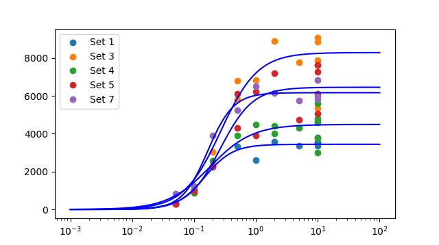
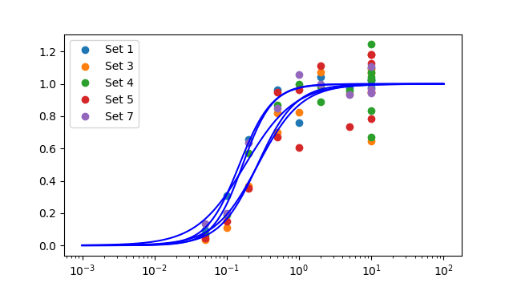
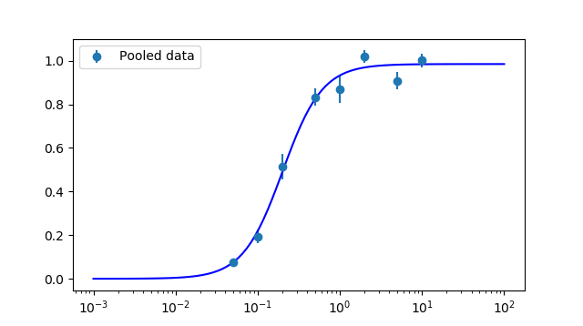

# CVFIT: Curve fitting program

Date and time of analysis: 2018/11/14 11:39:02
Machine: Pharm109; System: win32

# Original data:

Number of datasets loaded: 5

Set 1

 |  X  |  Y  |  s(Y)  |  weight | 
 |  ------  |  ------  |  ------  |  ------ | 
 |  0.05  |  319.964  |  0  |  1 | | 
 |  0.1  |  1052.76  |  0  |  1 | | 
 |  0.2  |  2254.67  |  0  |  1 | | 
 |  0.5  |  3319.22  |  0  |  1 | | 
 |  1  |  2616.93  |  0  |  1 | | 
 |  2  |  3593.12  |  0  |  1 | | 
 |  5  |  3352.19  |  0  |  1 | | 
 |  10  |  3782.98  |  0  |  1 | | 
 |  10  |  3515.37  |  0  |  1 | | 
 |  10  |  3536.82  |  0  |  1 | | 
 |  10  |  3366.5  |  0  |  1 | | 
   | | 

Set 3

 |  X  |  Y  |  s(Y)  |  weight | 
 |  ------  |  ------  |  ------  |  ------ | 
 |  0.05  |  306.079  |  0  |  1 | | 
 |  0.1  |  919.307  |  0  |  1 | | 
 |  0.2  |  3028.15  |  0  |  1 | | 
 |  0.5  |  5813.87  |  0  |  1 | | 
 |  0.5  |  6791.47  |  0  |  1 | | 
 |  1  |  6837.33  |  0  |  1 | | 
 |  2  |  8897.22  |  0  |  1 | | 
 |  5  |  7781.85  |  0  |  1 | | 
 |  10  |  5340.77  |  0  |  1 | | 
 |  10  |  7864.58  |  0  |  1 | | 
 |  10  |  8860.95  |  0  |  1 | | 
 |  10  |  9055.28  |  0  |  1 | | 
   | | 

Set 4

 |  X  |  Y  |  s(Y)  |  weight | 
 |  ------  |  ------  |  ------  |  ------ | 
 |  0.05  |  282.312  |  0  |  1 | | 
 |  0.1  |  855.595  |  0  |  1 | | 
 |  0.2  |  2562.56  |  0  |  1 | | 
 |  0.5  |  3911.4  |  0  |  1 | | 
 |  1  |  4492.65  |  0  |  1 | | 
 |  2  |  4426.95  |  0  |  1 | | 
 |  2  |  3999  |  0  |  1 | | 
 |  5  |  4307.51  |  0  |  1 | | 
 |  10  |  5588.11  |  0  |  1 | | 
 |  10  |  3752.53  |  0  |  1 | | 
 |  10  |  3003.99  |  0  |  1 | | 
 |  10  |  4824.4  |  0  |  1 | | 
 |  10  |  4606.37  |  0  |  1 | | 
 |  10  |  4689.06  |  0  |  1 | | 
   | | 

Set 5

 |  X  |  Y  |  s(Y)  |  weight | 
 |  ------  |  ------  |  ------  |  ------ | 
 |  0.05  |  296.948  |  0  |  1 | | 
 |  0.1  |  977.019  |  0  |  1 | | 
 |  0.2  |  2275.37  |  0  |  1 | | 
 |  0.5  |  4314.2  |  0  |  1 | | 
 |  0.5  |  6128.02  |  0  |  1 | | 
 |  1  |  3899.71  |  0  |  1 | | 
 |  1  |  6217.41  |  0  |  1 | | 
 |  2  |  7183.85  |  0  |  1 | | 
 |  5  |  4733.49  |  0  |  1 | | 
 |  10  |  6116.6  |  0  |  1 | | 
 |  10  |  5075.93  |  0  |  1 | | 
 |  10  |  7630.73  |  0  |  1 | | 
 |  10  |  7622.14  |  0  |  1 | | 
 |  10  |  7260.46  |  0  |  1 | | 
   | | 

Set 7

 |  X  |  Y  |  s(Y)  |  weight | 
 |  ------  |  ------  |  ------  |  ------ | 
 |  0.05  |  825.581  |  0  |  1 | | 
 |  0.1  |  1235.18  |  0  |  1 | | 
 |  0.2  |  3923.25  |  0  |  1 | | 
 |  0.5  |  5244.38  |  0  |  1 | | 
 |  1  |  6523.26  |  0  |  1 | | 
 |  2  |  6159.81  |  0  |  1 | | 
 |  5  |  5764.82  |  0  |  1 | | 
 |  10  |  6834.3  |  0  |  1 | | 
 |  10  |  5819.93  |  0  |  1 | | 
 |  10  |  5970.89  |  0  |  1 | | 
   | | 

# Set 1 fit finished

Number of point fitted = 11
Number of parameters estimated = 3
Degrees of freedom = 8
Residual error SD = 308.702      (variance = 95296.779)
Parameter 1: Ymin  	= 0  	  (fixed)
Parameter 2: Ymax  	= 3441.76  	  Approx SD = 126.855	  CV = 3.7
Parameter 3: EC50  	= 0.149401  	  Approx SD = 0.0227037	  CV = 15.2
Parameter 4: nH    	= 1.92299  	  Approx SD = 0.618571	  CV = 32.2
Minimum SSD = 762374.235; 
Max log-likelihood = -76.913
Correlation matrix = [!!!! PRINTOUT OF CORRELATION MATRIX NOT IMPLEMENTED YET. SORRY.

LIKELIHOOD INTERVALS
2.66-unit Likelihood Intervals  (equivalent SD for Gaussian- 2.31)
Lmax= -76.913;   Lcrit= -79.5718
Parameter 1:   Ymin	= 0	  (fixed)
Parameter 2:   Ymax	= 3441.76	  LOWER = 3172.08	  UPPER = 3761.71
Parameter 3:   EC50	= 0.149401	  LOWER = 0.108294	  UPPER = 0.223025
Parameter 4:   nH  	= 1.92299	  LOWER = 0.981329	  UPPER = 3.98462

# Set 3 fit finished

Number of point fitted = 12
Number of parameters estimated = 3
Degrees of freedom = 9
Residual error SD = 1174.920      (variance = 1380437.866)
Parameter 1: Ymin  	= 0  	  (fixed)
Parameter 2: Ymax  	= 8284.15  	  Approx SD = 526.84	  CV = 6.4
Parameter 3: EC50  	= 0.270345  	  Approx SD = 0.0660932	  CV = 24.4
Parameter 4: nH    	= 1.45123  	  Approx SD = 0.44539	  CV = 30.7
Minimum SSD = 12423940.792; 
Max log-likelihood = -100.129
Correlation matrix = [!!!! PRINTOUT OF CORRELATION MATRIX NOT IMPLEMENTED YET. SORRY.

LIKELIHOOD INTERVALS
2.56-unit Likelihood Intervals  (equivalent SD for Gaussian- 2.26)
Lmax= -100.129;   Lcrit= -102.687
Parameter 1:   Ymin	= 0	  (fixed)
Parameter 2:   Ymax	= 8284.15	  LOWER = 6771.24	  UPPER = 9186.08
Parameter 3:   EC50	= 0.270345	  LOWER = 0.142742	  UPPER = 0.438974
Parameter 4:   nH  	= 1.45123	  LOWER = 0.872725	  UPPER limit not found

# Set 4 fit finished

Number of point fitted = 14
Number of parameters estimated = 3
Degrees of freedom = 11
Residual error SD = 683.676      (variance = 467413.121)
Parameter 1: Ymin  	= 0  	  (fixed)
Parameter 2: Ymax  	= 4490.56  	  Approx SD = 251.951	  CV = 5.6
Parameter 3: EC50  	= 0.180194  	  Approx SD = 0.051064	  CV = 28.3
Parameter 4: nH    	= 1.27711  	  Approx SD = 0.424834	  CV = 33.3
Minimum SSD = 5141544.336; 
Max log-likelihood = -109.562
Correlation matrix = [!!!! PRINTOUT OF CORRELATION MATRIX NOT IMPLEMENTED YET. SORRY.

WARNING: SOME PARAMETERS POORLY DEFINED (CV > 33%); try different guesses

LIKELIHOOD INTERVALS
2.42-unit Likelihood Intervals  (equivalent SD for Gaussian- 2.2)
Lmax= -109.562;   Lcrit= -111.984
Parameter 1:   Ymin	= 0	  (fixed)
Parameter 2:   Ymax	= 4490.56	  LOWER = 3827.71	  UPPER = 5026.69
Parameter 3:   EC50	= 0.180194	  LOWER = 0.0974363	  UPPER = 0.351416
Parameter 4:   nH  	= 1.27711	  LOWER = 0.758441	  UPPER limit not found

# Set 5 fit finished

Number of point fitted = 14
Number of parameters estimated = 3
Degrees of freedom = 11
Residual error SD = 1169.980      (variance = 1368853.563)
Parameter 1: Ymin  	= 0  	  (fixed)
Parameter 2: Ymax  	= 6452.43  	  Approx SD = 494.246	  CV = 7.7
Parameter 3: EC50  	= 0.266666  	  Approx SD = 0.0801916	  CV = 30.1
Parameter 4: nH    	= 1.65824  	  Approx SD = 0.743895	  CV = 44.9
Minimum SSD = 15057389.196; 
Max log-likelihood = -117.083
Correlation matrix = [!!!! PRINTOUT OF CORRELATION MATRIX NOT IMPLEMENTED YET. SORRY.

WARNING: SOME PARAMETERS POORLY DEFINED (CV > 33%); try different guesses

LIKELIHOOD INTERVALS
2.42-unit Likelihood Intervals  (equivalent SD for Gaussian- 2.2)
Lmax= -117.083;   Lcrit= -119.506
Parameter 1:   Ymin	= 0	  (fixed)
Parameter 2:   Ymax	= 6452.43	  LOWER = 5483.58	  UPPER = 8088.43
Parameter 3:   EC50	= 0.266666	  LOWER = 0.133945	  UPPER = 0.576924
Parameter 4:   nH  	= 1.65824	  LOWER = 0.609339	  UPPER limit not found

# Set 7 fit finished

Number of point fitted = 10
Number of parameters estimated = 3
Degrees of freedom = 7
Residual error SD = 456.347      (variance = 208252.882)
Parameter 1: Ymin  	= 0  	  (fixed)
Parameter 2: Ymax  	= 6165.73  	  Approx SD = 195.091	  CV = 3.2
Parameter 3: EC50  	= 0.166126  	  Approx SD = 0.0194908	  CV = 11.7
Parameter 4: nH    	= 2.09925  	  Approx SD = 0.509406	  CV = 24.3
Minimum SSD = 1457770.176; 
Max log-likelihood = -73.639
Correlation matrix = [!!!! PRINTOUT OF CORRELATION MATRIX NOT IMPLEMENTED YET. SORRY.

LIKELIHOOD INTERVALS
2.8-unit Likelihood Intervals  (equivalent SD for Gaussian- 2.37)
Lmax= -73.6386;   Lcrit= -76.4352
Parameter 1:   Ymin	= 0	  (fixed)
Parameter 2:   Ymax	= 6165.73	  LOWER = 5731.38	  UPPER = 6629.83
Parameter 3:   EC50	= 0.166126	  LOWER = 0.127683	  UPPER = 0.221495
Parameter 4:   nH  	= 2.09925	  LOWER = 1.28276	  UPPER = 4.16991

# Average of all fits:

Average of estimates of 5 sets (mean +/- sdm):
Parameter 1: Ymin  	= 0 +/- 0
	(all: 0.0	0.0	0.0	0.0	0.0
Parameter 2: Ymax  	= 5766.93 +/- 748.356
	(all: 3441.7550903107626	8284.153479615938	4490.562059459366	6452.430835637782	6165.731335818786
Parameter 3: EC50  	= 0.206547 +/- 0.0230466
	(all: 0.14940067850526303	0.2703454480476842	0.18019369554834683	0.2666664726771879	0.16612630906267556
Parameter 4: nH    	= 1.68177 +/- 0.134154
	(all: 1.9229919384270482	1.4512345713316686	1.2771068390397633	1.6582426025500328	2.0992539683289126

# Data normalised to the fitted maxima

# Pooled data fit finished

Number of point fitted = 61
Number of parameters estimated = 3
Degrees of freedom = 58
Residual error SD = 0.131      (variance = 0.017)
Parameter 1: Ymin  	= 0  	  (fixed)
Parameter 2: Ymax  	= 0.984893  	  Approx SD = 0.0237539	  CV = 2.4
Parameter 3: EC50  	= 0.200719  	  Approx SD = 0.020684	  CV = 10.3
Parameter 4: nH    	= 1.79676  	  Approx SD = 0.29285	  CV = 16.3
Minimum SSD = 0.990; 
Max log-likelihood = 39.141
Correlation matrix = [!!!! PRINTOUT OF CORRELATION MATRIX NOT IMPLEMENTED YET. SORRY.

LIKELIHOOD INTERVALS
2-unit Likelihood Intervals  (equivalent SD for Gaussian- 2)
Lmax= 39.1408;   Lcrit= 37.1366
Parameter 1:   Ymin	= 0	  (fixed)
Parameter 2:   Ymax	= 0.984893	  LOWER = 0.939008	  UPPER = 1.03389
Parameter 3:   EC50	= 0.200719	  LOWER = 0.16416	  UPPER = 0.247428
Parameter 4:   nH  	= 1.79676	  LOWER = 1.32267	  UPPER = 2.58691

