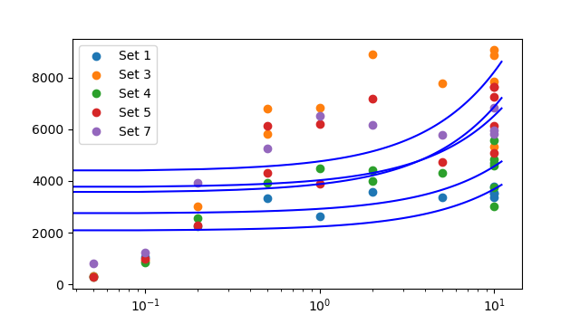

# CVFIT: Curve fitting program

Date and time of analysis: 2018/11/14 11:39:20
Machine: Pharm109; System: win32

# Original data:

Number of datasets loaded: 5

Set 1

 |  X  |  Y  |  s(Y)  |  weight | 
 |  ------  |  ------  |  ------  |  ------ | 
 |  0.05  |  319.964  |  0  |  1 | | 
 |  0.1  |  1052.76  |  0  |  1 | | 
 |  0.2  |  2254.67  |  0  |  1 | | 
 |  0.5  |  3319.22  |  0  |  1 | | 
 |  1  |  2616.93  |  0  |  1 | | 
 |  2  |  3593.12  |  0  |  1 | | 
 |  5  |  3352.19  |  0  |  1 | | 
 |  10  |  3782.98  |  0  |  1 | | 
 |  10  |  3515.37  |  0  |  1 | | 
 |  10  |  3536.82  |  0  |  1 | | 
 |  10  |  3366.5  |  0  |  1 | | 
   | | 

Set 3

 |  X  |  Y  |  s(Y)  |  weight | 
 |  ------  |  ------  |  ------  |  ------ | 
 |  0.05  |  306.079  |  0  |  1 | | 
 |  0.1  |  919.307  |  0  |  1 | | 
 |  0.2  |  3028.15  |  0  |  1 | | 
 |  0.5  |  5813.87  |  0  |  1 | | 
 |  0.5  |  6791.47  |  0  |  1 | | 
 |  1  |  6837.33  |  0  |  1 | | 
 |  2  |  8897.22  |  0  |  1 | | 
 |  5  |  7781.85  |  0  |  1 | | 
 |  10  |  5340.77  |  0  |  1 | | 
 |  10  |  7864.58  |  0  |  1 | | 
 |  10  |  8860.95  |  0  |  1 | | 
 |  10  |  9055.28  |  0  |  1 | | 
   | | 

Set 4

 |  X  |  Y  |  s(Y)  |  weight | 
 |  ------  |  ------  |  ------  |  ------ | 
 |  0.05  |  282.312  |  0  |  1 | | 
 |  0.1  |  855.595  |  0  |  1 | | 
 |  0.2  |  2562.56  |  0  |  1 | | 
 |  0.5  |  3911.4  |  0  |  1 | | 
 |  1  |  4492.65  |  0  |  1 | | 
 |  2  |  4426.95  |  0  |  1 | | 
 |  2  |  3999  |  0  |  1 | | 
 |  5  |  4307.51  |  0  |  1 | | 
 |  10  |  5588.11  |  0  |  1 | | 
 |  10  |  3752.53  |  0  |  1 | | 
 |  10  |  3003.99  |  0  |  1 | | 
 |  10  |  4824.4  |  0  |  1 | | 
 |  10  |  4606.37  |  0  |  1 | | 
 |  10  |  4689.06  |  0  |  1 | | 
   | | 

Set 5

 |  X  |  Y  |  s(Y)  |  weight | 
 |  ------  |  ------  |  ------  |  ------ | 
 |  0.05  |  296.948  |  0  |  1 | | 
 |  0.1  |  977.019  |  0  |  1 | | 
 |  0.2  |  2275.37  |  0  |  1 | | 
 |  0.5  |  4314.2  |  0  |  1 | | 
 |  0.5  |  6128.02  |  0  |  1 | | 
 |  1  |  3899.71  |  0  |  1 | | 
 |  1  |  6217.41  |  0  |  1 | | 
 |  2  |  7183.85  |  0  |  1 | | 
 |  5  |  4733.49  |  0  |  1 | | 
 |  10  |  6116.6  |  0  |  1 | | 
 |  10  |  5075.93  |  0  |  1 | | 
 |  10  |  7630.73  |  0  |  1 | | 
 |  10  |  7622.14  |  0  |  1 | | 
 |  10  |  7260.46  |  0  |  1 | | 
   | | 

Set 7

 |  X  |  Y  |  s(Y)  |  weight | 
 |  ------  |  ------  |  ------  |  ------ | 
 |  0.05  |  825.581  |  0  |  1 | | 
 |  0.1  |  1235.18  |  0  |  1 | | 
 |  0.2  |  3923.25  |  0  |  1 | | 
 |  0.5  |  5244.38  |  0  |  1 | | 
 |  1  |  6523.26  |  0  |  1 | | 
 |  2  |  6159.81  |  0  |  1 | | 
 |  5  |  5764.82  |  0  |  1 | | 
 |  10  |  6834.3  |  0  |  1 | | 
 |  10  |  5819.93  |  0  |  1 | | 
 |  10  |  5970.89  |  0  |  1 | | 
   | | 

# Set 1 fit finished

Number of point fitted = 11
Number of parameters estimated = 2
Degrees of freedom = 9
Residual error SD = 914.275      (variance = 835899.486)
Parameter 1: a  	= 2075.25  	  Approx SD = 391.478	  CV = 18.9
Parameter 2: b  	= 161.367  	  Approx SD = 62.5916	  CV = 38.8
Minimum SSD = 7523095.377; 
Max log-likelihood = -89.504
Correlation matrix = [!!!! PRINTOUT OF CORRELATION MATRIX NOT IMPLEMENTED YET. SORRY.

WARNING: SOME PARAMETERS POORLY DEFINED (CV > 33%); try different guesses

LIKELIHOOD INTERVALS
2.56-unit Likelihood Intervals  (equivalent SD for Gaussian- 2.26)
Lmax= -89.5041;   Lcrit= -92.0624
Parameter 1:   a	= 2075.25	  LOWER = 1172.43	  UPPER = 2978.93
Parameter 2:   b	= 161.367	  LOWER = 17.0196	  UPPER = 305.853

# Set 3 fit finished

Number of point fitted = 12
Number of parameters estimated = 2
Degrees of freedom = 10
Residual error SD = 2599.654      (variance = 6758200.921)
Parameter 1: a  	= 4372.68  	  Approx SD = 1032.17	  CV = 23.6
Parameter 2: b  	= 385.506  	  Approx SD = 172.317	  CV = 44.7
Minimum SSD = 67582009.215; 
Max log-likelihood = -110.291
Correlation matrix = [!!!! PRINTOUT OF CORRELATION MATRIX NOT IMPLEMENTED YET. SORRY.

WARNING: SOME PARAMETERS POORLY DEFINED (CV > 33%); try different guesses

LIKELIHOOD INTERVALS
2.48-unit Likelihood Intervals  (equivalent SD for Gaussian- 2.23)
Lmax= -110.291;   Lcrit= -112.773
Parameter 1:   a	= 4372.68	  LOWER = 2037.07	  UPPER = 6708.28
Parameter 2:   b	= 385.506	  LOWER limit not found	  UPPER = 775.428

# Set 4 fit finished

Number of point fitted = 14
Number of parameters estimated = 2
Degrees of freedom = 12
Residual error SD = 1309.799      (variance = 1715573.869)
Parameter 1: a  	= 2738.25  	  Approx SD = 530.922	  CV = 19.4
Parameter 2: b  	= 183.019  	  Approx SD = 78.8762	  CV = 43.1
Minimum SSD = 20586886.432; 
Max log-likelihood = -119.273
Correlation matrix = [!!!! PRINTOUT OF CORRELATION MATRIX NOT IMPLEMENTED YET. SORRY.

WARNING: SOME PARAMETERS POORLY DEFINED (CV > 33%); try different guesses

LIKELIHOOD INTERVALS
2.37-unit Likelihood Intervals  (equivalent SD for Gaussian- 2.18)
Lmax= -119.273;   Lcrit= -121.647
Parameter 1:   a	= 2738.25	  LOWER = 1572.34	  UPPER = 3907.56
Parameter 2:   b	= 183.019	  LOWER = 9.80466	  UPPER = 356.736

# Set 5 fit finished

Number of point fitted = 14
Number of parameters estimated = 2
Degrees of freedom = 12
Residual error SD = 1937.378      (variance = 3753434.683)
Parameter 1: a  	= 3544.92  	  Approx SD = 724.633	  CV = 20.4
Parameter 2: b  	= 333.106  	  Approx SD = 117.6	  CV = 35.3
Minimum SSD = 45041216.197; 
Max log-likelihood = -124.753
Correlation matrix = [!!!! PRINTOUT OF CORRELATION MATRIX NOT IMPLEMENTED YET. SORRY.

WARNING: SOME PARAMETERS POORLY DEFINED (CV > 33%); try different guesses

LIKELIHOOD INTERVALS
2.37-unit Likelihood Intervals  (equivalent SD for Gaussian- 2.18)
Lmax= -124.753;   Lcrit= -127.127
Parameter 1:   a	= 3544.92	  LOWER = 1953.61	  UPPER = 5140.86
Parameter 2:   b	= 333.106	  LOWER = 74.8533	  UPPER = 592.11

# Set 7 fit finished

Number of point fitted = 10
Number of parameters estimated = 2
Degrees of freedom = 8
Residual error SD = 1867.897      (variance = 3489040.204)
Parameter 1: a  	= 3750.68  	  Approx SD = 801.556	  CV = 21.4
Parameter 2: b  	= 277.855  	  Approx SD = 139.469	  CV = 50.2
Minimum SSD = 27912321.633; 
Max log-likelihood = -88.399
Correlation matrix = [!!!! PRINTOUT OF CORRELATION MATRIX NOT IMPLEMENTED YET. SORRY.

WARNING: SOME PARAMETERS POORLY DEFINED (CV > 33%); try different guesses

LIKELIHOOD INTERVALS
2.66-unit Likelihood Intervals  (equivalent SD for Gaussian- 2.31)
Lmax= -88.3994;   Lcrit= -91.0582
Parameter 1:   a	= 3750.68	  LOWER = 1851.75	  UPPER = 5645.99
Parameter 2:   b	= 277.855	  LOWER limit not found	  UPPER = 607.636

# Average of all fits:

Average of estimates of 5 sets (mean +/- sdm):
Parameter 1: a  	= 3296.36 +/- 359.401
	(all: 2075.2492478793083	4372.675283176937	2738.25491622987	3544.9204592899423	3750.6751129137583
Parameter 2: b  	= 268.171 +/- 38.3332
	(all: 161.36721629984646	385.506428449171	183.0187556123546	333.1064950001841	277.8547572233729

